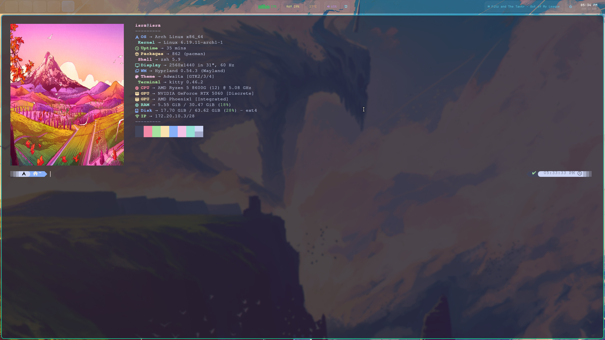

# 🐻 Isra Dotfiles - Gentoo + Hyprland + Quickshell


Una configuración moderna, minimalista y estética de **Hyprland** impulsada por **Quickshell** para una experiencia de escritorio fluida y altamente personalizable utilizando el esquema de colores **Catppuccin Mocha**.

> **Versión Gentoo** — Adaptada para Gentoo Linux con **OpenRC**. Para la versión original de Arch Linux, ver el [repositorio principal](https://github.com/Khinmmad/isra_dotfiles).



## 🌟 Características

- **Panel Superior Dinámico (Quickshell)**:
  - **Workspaces**: Indicadores tipo píldora con transiciones suaves.
  - **Módulo de Música**: Control total de Spotify y otros reproductores con barra de progreso deslizable, control de volumen y lanzador automático.
  - **Información del Sistema**: Popups interactivos con detalles de CPU y RAM.
  - **Reloj y Calendario**: Vista detallada de fecha al pasar el mouse.
- **Lanzador de Aplicaciones**: Menú premium integrado en el panel con acceso rápido y menú de energía.
- **Estética "Smooth"**: Bordes redondeados (24px), micro-animaciones y feedback visual consistente.
- **Gestión de Red**: Integración con `rofi-network-manager`.

## 🛠️ Stack Tecnológico

- **Compositor**: [Hyprland](https://hyprland.org/)
- **Panel / Shell**: [Quickshell](https://outfoxxed.github.io/quickshell/) (QML)
- **Lanzador / Menús**: [Rofi](https://github.com/davatorium/rofi)
- **Terminal**: [Kitty](https://sw.kovidgoyal.net/kitty/)
- **Notificaciones**: [Dunst](https://dunst-project.org/)
- **Fondo de Pantalla**: [Awww](https://github.com/IsaacMarovitz/awww)
- **Colores**: [Catppuccin Mocha](https://github.com/catppuccin/catppuccin)

## 📋 Requisitos

- **Gentoo Linux** con perfil `desktop` o superior
- **OpenRC** como init system
- **Kernel** con soporte Wayland (DRM, KMS)
- **GPU** con drivers instalados (NVIDIA, AMD, o Intel)
- **Python 3.11+** (para el installer)
- Conexión a internet

### Overlays necesarios (se instalan automáticamente)

- **hyproverlay** — Hyprland y herramientas asociadas (codeberg.org)
- **GURU** — Paquete `eww` y otros extras

## 🚀 Instalación

1. **Clonar el repositorio:**
   ```bash
   git clone https://github.com/Khinmmad/isra_dotfiles.git
   cd isra_dotfiles
   ```

2. **Ejecutar el instalador:**
   ```bash
   chmod +x install.sh
   ./install.sh
   ```

   El script automáticamente:
   - Añade los overlays necesarios (hyproverlay, GURU)
   - Instala todos los paquetes desde Portage
   - Compila desde source los paquetes no disponibles en Portage (awww, quickshell, temas)
   - Configura Oh My Zsh + Powerlevel10k
   - Copia todas las configs a `~/.config/`
   - Habilita los servicios de OpenRC
   - Configura SDDM para Hyprland

3. **Reiniciar**: Una vez finalizada la instalación, reinicia tu sesión para aplicar todos los cambios.

> [!NOTE]
> Si usas **GRUB** gestionado por otro sistema (triple boot), el script NO modifica GRUB. Añade manualmente `nvidia-drm.modeset=1` a los parámetros del kernel si tienes GPU NVIDIA.

## ⚙️ Configuración post-instalación

### Monitor
El monitor está configurado como `DP-2,2560x1440@200,0x0,1` en `~/.config/hypr/hyprland.conf`. Ajusta según tu hardware:

```bash
hyprctl monitors  # Ver nombre y modos disponibles
```

### Spotify
Si instalas Spotify vía Flatpak, la ruta en `~/.config/spicetify/config-xpui.ini` puede necesitar ajuste.

### Waybar vs Quickshell
Este dotfile usa **Quickshell** como barra principal. Si prefieres Waybar, descomenta las líneas correspondientes en `hyprland.conf`.

## 📁 Estructura del Proyecto

```bash
isra-dotfiles-gentoo/
├── assets/         # Imágenes y capturas de pantalla
├── configs/        # Configuraciones maestras (se enlazan a ~/.config/)
│   ├── hypr/       # Configuración de Hyprland
│   ├── quickshell/  # Código QML del panel
│   ├── kitty/      # Estilos de la terminal
│   └── ...
├── wallpapers/     # Colección de fondos de pantalla
└── install.sh      # Script de instalación automatizada (Gentoo/OpenRC)
```

## 🔧 Troubleshooting

| Problema | Solución |
|---|---|
| Quickshell no compila | Instala `dev-qt/qtbase[gui widgets network]` y `dev-qt/qtdeclarative` |
| Hyprland no inicia | Verifica `nvidia-drm.modeset=1` en GRUB (NVIDIA) |
| Suspend no funciona | Instala `sys-power/pm-utils` para `pm-suspend` |
| Awww falla | Verifica que `cargo` esté instalado y en PATH |

## 🤝 Contribuciones

Siéntete libre de abrir un *Issue* o enviar un *Pull Request* para mejorar cualquier parte de la configuración.

---
Desarrollado con ❤️ por [Khinmmad](https://github.com/Khinmmad)
